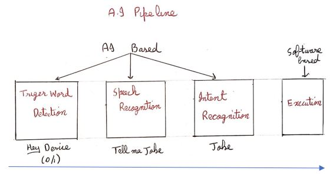
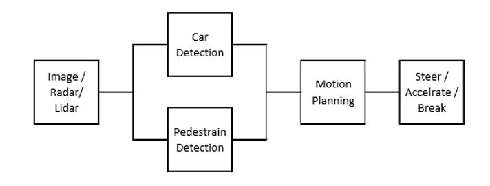
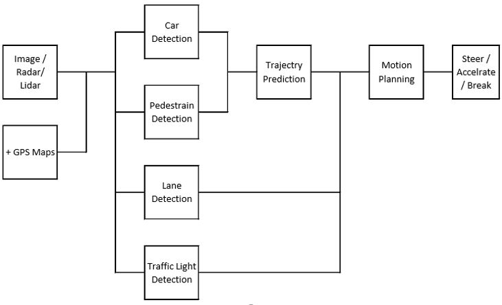
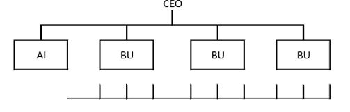
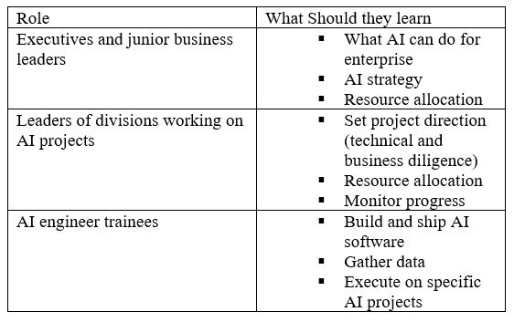
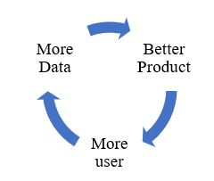

# Building AI in your Company

You will learn about role of AI team, AI transformation playbook, pitfalls to avoid

1. [Case Studies](README.md#1-case-studies)
2. [Some Role of an AI Team](README.md#2-some-role-of-an-ai-team)
3. [AI Transformation Playbook](README.md#3-ai-transformation-playbook)
4. [Pitfalls of AI](README.md#4-pitfalls-of-ai)
5. [Taking the First Step](README.md#5-taking-the-first-step)
6. [Survey of AI App Areas](README.md#6-survey-of-ai-app-areas)
7. [Survey of AI Techniques](README.md#7-survey-of-ai-techniques)

## 1. Case Studies

- Smart speakers

  - Steps to process the command

    

  - Hi device, set timer for 10 minutes.
    - Hi devise --- trigger word detection
    - set timer for 10 minutes --- Speech Recognition
    - set timer, 10 minutes --- Intent Recognition
    - Execution

- Self-Driving Car

  - Key steps

    - Car detection
    - Pedestrian detection
    - Motion planning

    

  - Steps for how to drive

    

[Top of Page](README.md#building-ai-in-your-company)

## 2. Some Role of an AI Team

- Example roles of large AI team
  - AI team may have 100s of engineers
  - A small team can have four or five members
  - Examples roles
    - Software Engineer
    - Machine Learning Engineer
    - Machine learning Research Engineer
    - Applied ML Engineer
- Data Scientist
  - Examine data and provide insights
  - Make presentation to team / executive
- Data Engineer
  - Organize data
  - Make sure data is saved in an easily accessible, secure and cost-effective way
- AI Product Manager
  - Help decide what to build; what feasible and valuable
- Get started with a small team
  - 1 software engineer
  - 1 ML engineer / Data scientist
  - No body but yourself

[Top of Page](README.md#building-ai-in-your-company)

## 3. AI Transformation Playbook

- What is a Playbook?
  - Playbooks are vital to an organization, from business to professional sports teams. Simply put, they help organizations plan and strategize tactics that will ultimately bring them success. Its vital for organizations to stay a step ahead of their industry and create playbooks for aspects that will impact their bottom line, such as recruiting to talent.
- AI transformation Playbook

  - Execute pilot projects to gain momentum
    - More important for the initial project to succeed rather than be the most valuable
    - Show traction within 6-12 months
    - Can be in-house or outsourced
  - Build an in-house AI team

    

    - Bu = Business Unit
    - AI function can be under CTO, CIO, CDO or CAIO etc.

  - Provide Broad AI training

    - Resources

      - Online courses
      - Books
      - Curate rather than create content

        

  - Develop an AI strategy

    - Leverage AI to create an advantage specific to your industry sector
    - Design strategy aligned with the “Virtuous Cycle of AI”

      

    - AI needs to be specialized or verticalized to your industry sector
    - Don’t compete with giants
    - Consider creating a data strategy
      - Strategic data acquisition
      - Unified data ware house
    - Create network effects and platform advantages
      - In industries with “winner take all” dynamics, AI can be an accelerator

  - Develop internal and external communication
    - Investor relations
    - Government relations
    - Consumer / user education
    - Talent / recruitment
    - Internal communications

[Top of Page](README.md#building-ai-in-your-company)

## 4. Pitfalls of AI

- A pitfall to avoid
  - Don’t
    - Expect AI to solve every thing
    - Hire 2-3 ML engineers and count solely on them to come up with use cases
    - Expect the AI project to work the first time
    - Expect traditional planning process to apply without changes
    - Think you need superstar AI engineers before you can do anything
  - Do
    - Be realistic about what AI can and cannot do given limitations of technology, data & engineering resources
    - Pair engineering talent with business talent & work cross-functionally to find feasible & valuable project
    - Plan for AI development to be an iterative process, with multiple attempts needed to succeed
    - Work with AI team to establish timeline estimates, mile stones, kPIs, etc
    - Keep building the team, but get going with the team you have

[Top of Page](README.md#building-ai-in-your-company)

## 5. Taking the First Step

- Some initial steps you can take
  - Get friends to learn about AI
    - This course
    - Reading group
  - Start brainstorming projects
    - No project is too small
  - Hire a few ML / DS people to help
  - Hire or appoint an AI leader (VP AI, CAIO, etc.)
  - Discuss with CEO / Board possibilities of AI transformation
    - Will your company be much more valuable and / or more effective if it were good at AI?

[Top of Page](README.md#building-ai-in-your-company)

## 6. Survey of AI App Areas

- AI Application areas
  - Computer Vision
    - Image classification / Object recognition / face recognition
    - Object detection
    - Image segmentation
    - Tracking
  - Natural language processing
    - Text classification
      - Sentiment recognition
      - Spam filtering
    - Information retrieval
      - Web search
    - Name entity recognition
    - Machine translation
    - Part of speech tagging
    - Speech
      - Speech recognition (speech to text)
      - Trigger word / wake word detection
      - Speaker ID
      - Speech synthesis (text to speech, TTS)
  - Robotics
    - Perception
    - Motion planning
    - control
  - General Machine Learning
    - Unstructured data
    - Structured data
    - Most of the work on unstructured data

[Top of Page](README.md#building-ai-in-your-company)

## 7. Survey of AI Techniques

- The value today of unsupervised learning is a lot smaller than value created through supervised learning
- Supervised learning
- Unsupervised learning
  - Clustering
    - Group data on common idea
- Transfer learning
  - Learn task A and use knowledge to help on task B
  - This can be done as first layers are almost same
- Reinforcement learning
  - Only data is given, no labels nothing
  - Reward based
- GANs (Generative Adversarial Network)
  - Created due to self-learning model
  - Synthesize new image from scratch
  - Used in animation industry
- Knowledge Graphs

[Top of Page](README.md#building-ai-in-your-company)

[<--- Previous Page](../README.md)
