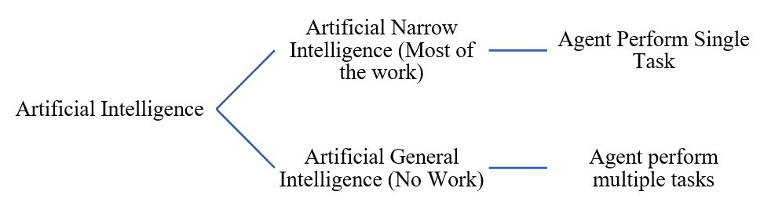
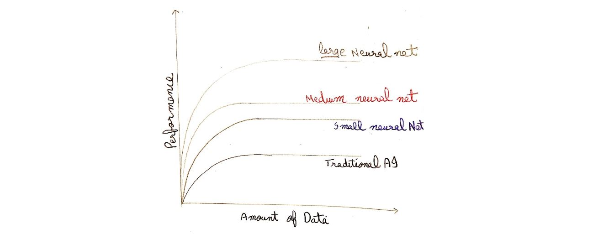
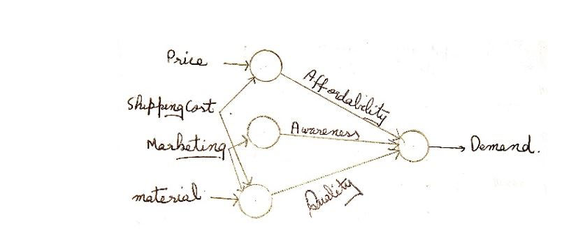
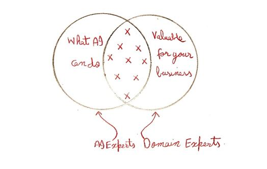

# What is AI?

1. [Intro to AI](README.md#1-intro-to-ai)
2. [Impact of AI in Industries](README.md#2-impact-of-ai-in-industries)
3. [ANI vs AGI](README.md#3-ani-vs-agi)
4. [Machine Learning](README.md#4-machine-learning)
5. [Why Now](README.md#5-why-now.)
6. [What is Data?](README.md#6-what-is-data)
7. [Acquiring Data?](README.md#7-acquiring-data)
8. [Use and Misuse of Data](README.md#8-use-and-misuse-of-data)
9. [Data Science vs Machine Learning](README.md#9-data-science-vs-machine-learning)
10. [Intro to Deep Learning](README.md#10-intro-to-deep-learning)
11. [AI Related Disciplines](README.md#11-ai-related-disciplines)
12. [What Makes an AI Company?](README.md#12-what-makes-an-ai-company)
13. [Examples Supervised Learning](README.md#13-examples-supervised-learning)
14. [Limitations of Machine Learning](README.md#14-limitations-of-machine-learning)
15. [Machine Learning Examples](README.md#15-machine-learning-examples)
16. [Data Science Examples](README.md#16-data-science-examples)
17. [Machine Learning Hanging Job Function](README.md#17-machine-learning-changing-job-function)
18. [Working with AI Team](README.md#18-working-with-ai-team)
19. [Machine Learning Tools](README.md#19-machine-learning-tools)

## 1. Intro to AI

- Objective of Course
  - What is data science, machine learning, AI definitions?
  - What AI can do and can’t to
  - How to create an opportunity to use AI in daily life
  - Requirements for a project based on AI
  - How to work with a team for AI projects
  - Discussion regarding AI

[Top of Page](README.md#what-is-ai)

## 2. Impact of AI in Industries

- High scope of AI in industries of all types.

[Top of Page](README.md#what-is-ai)

## 3. ANI vs AGI

- Examples
  - ANI
    - Smart Speakers
    - Self-Driving Car
    - AI to do web search
    - AI applications in farming industries
  - AGI
    - Super humans
- Ultimate goal of AI is AGI
- Progress in AGI is the thing to worry about, considering machines taking over humans

[Top of Page](README.md#what-is-ai)

## 4. Machine Learning

- Machine learning
  - Supervised learning
    - During learning data as well as labels are provided
    - Mapping input A to output B
  - Unsupervised learning
    - Data is provided without and labels
  - Reinforcement learning
- Examples of supervised learning
  - Speech recognition
    - Sound to transcript
  - Machine translation
    - One language to other
  - Online Ads
    - Based on user interest
  - Self-Driving Car
    - Input from sensors results driving
  - Manufacturing industry
    - Sorting broken phones

[Top of Page](README.md#what-is-ai)

## 5. Why Now.

- Higher data higher performance
  

[Top of Page](README.md#what-is-ai)

## 6. What is Data?

- What enables machine learning to work so well
  - Data
- Tabular form of data

| Size of house | No. of rooms | Price |
| :-----------: | :----------: | :---: |
|               |              |       |
|               |              |       |
|               |              |       |
|       A       |      A       |   B   |

- Columns known as feature
- Rows knows as entry
- A is input
- B is output
- If three columns mean three features
- Data is unique to every business

[Top of Page](README.md#what-is-ai)

## 7. Acquiring Data?

- Labeling of data
  - Manual labeling
    - We specify the output for each input by our self
    - when we have both A & B
  - Human Behavior
    - Data from ecommerce site
  - Machine Behavior
    - From logs we can predict fault
- Acquiring data
  - From website
  - Personal experience
  - Partnership with some source

[Top of Page](README.md#what-is-ai)

## 8. Use and Misuse of Data

- Garbage in Garbage out
- Collect data according to project and collaboration with AI team
- Not necessarily every data is valuable
- Problems in data
  - Data can be messy
  - Incorrect
  - Missing
  - try to avoid such data
- Unstructured data
  - Multiple types of data
  - Image, audio and text
- Structured data
  - tables

[Top of Page](README.md#what-is-ai)

## 9. Data Science vs Machine Learning

- Data Science
  - Output is a set of insights that can help making business decisions
- Machine Learning
  - Is a software which gives output for an input
- Online ad agencies use AI, ML and DS.

[Top of Page](README.md#what-is-ai)

## 10. Intro to Deep Learning

- Circles are nodes / neurons
- We can only control input or output layer
- Internal layers are hidden
- Densely connected network
  - If neurons of one layer are connected with all the neurons of next layer then known as densely connected network.
- Neural network has nothing to do with actual human brain

[Top of Page](README.md#what-is-ai)

## 11. AI Related Disciplines

- Machine learning
- Data science
- Deep learning / neural network
- Supervised learning
- Un supervised Learning
- Reinforced Learning
- Graphical models
- Planning
- Knowledge graphs
- Most important are machine learning, data science and deep learning

  

[Top of Page](README.md#what-is-ai)

## 12. What Makes an AI Company?

- Internet Era
  - A mall + website doesn’t make internet company
  - A/B testing
  - Short iteration time
  - Decision making pushed down to engineers and other specialized roles
- AI Era
  - Any company + deep learning doesn’t make AI company
- Properties of an AI company
  - Strategic Data Acquisition
    - What are sources of data collection
  - Unified data ware house
    - As access to data is more frequent
  - Pervasive Automation
    - Always consider about process automation
  - New role such as MLE
    - Staff according to field of AI
- AI Transformation
  - Execute pilot project to gain momentum
  - Build an in-house AI team
  - Provide broad AI training
  - Develop an AI strategy considering your expertise
  - Develop internal and external communication to tell about you being an AI company
- Deciding about a new project
  - Technical diligence
    - feasible project?
    - Can AI Do that?
  - Anything we can do in a second of thought can be automated using S.L.

[Top of Page](README.md#what-is-ai)

## 13. Examples Supervised Learning

|       Data        |                        |     Application     |
| :---------------: | :--------------------- | :-----------------: |
|     Input (A)     | Output (B)             |                     |
|       Email       | Spam (0/1)             |   Spam filtering    |
|       Audio       | Text transcript        | Speech recognition  |
|      English      | Urdu                   | Machine translation |
|   Ad, user info   | Click? (0/1)           | Online advertising  |
| Image, radar info | Position of other cars |  Self-driving car   |
|  Image of phone   | Defect? (0/1)          |  Visual inspection  |

[Top of Page](README.md#what-is-ai)

## 14. Limitations of Machine Learning

- What machine learning can and cannot do?
  - We can’t send a full reply to a mail
  - In case of self-driving cars, we can drive but can’t understand gestures
  - Critical application requires good accuracy
- Technical diligence rule
  - Idea should be simple
  - Large amount of data
- Strengths and weakness of ML
  - Works when,
    - Learning a simple concept
    - Lots of data available
  - Doesn’t work when,
    - Learning a complex concept
    - Asked to work on new type of data such as X-ray images in different conditions and angles

[Top of Page](README.md#what-is-ai)

## 15. Machine Learning Examples

- Sales purchase

  

- Face Recognition
  - Picture comprises pixels
    - Color images and channels
  - A neural network corresponds to pixels
  - Earlier layers will detect edges, then lobes and then objects
- Speech Recognition
  - Collect data
    - Labelled voice
  - Train model
    - Iterate many times
  - Deploy the model
    - Get more data and update model
- Self-driving car
  - Collect data
    - Image to position of another car
  - Train model
    - Iterate many times until good enough
  - Deploy model
    - Get data back
    - Maintain / update model

[Top of Page](README.md#what-is-ai)

## 16. Data Science Examples

- Let’s see key step using an example
- Optimizing a sales funnel
  - Collect data
  - Analyze dada
    - Iterate many times to get good insights
  - Suggest hypotheses/actions
    - Deploy changes
    - Re-analyze new data periodically
- Data Science gives an insight.

[Top of Page](README.md#what-is-ai)

## 17. Machine Learning Changing Job Function

- Sales
  - Identifying sales opportunities
  - Prioritizing
- Manufacturing Line manger
  - Optimize manufacturing
  - Machine learning can spot defects
- Recruiting
  - Identifying how people prefer recruiting
  - Spot good candidates
- Marketing
  - A/B testing
  - Customized product recommendation
- Agriculture
  - Crop Analytics
  - Precision weed killing

[Top of Page](README.md#what-is-ai)

## 18. Working with AI Team

- Starting an AI Project
  - Workflow of projects
  - Selecting AI Project
  - Organizing data and team for projects.
- How to choose an AI project
  - Chose cross functional teams - Some people of AI - Some of business planning
    
- Brain Storming Frame work
  - Automate task rather than job
    - Automate task of a doctor
    - Automate task in a call center
  - Main drivers of business value
  - What are the main pain points in your business?
- Is it always necessary to have big data?
  - No
  - Having more data is helpful
  - Data make some business defensible
  - With small dataset you can make progress
  - 10, 100 or 1000 data points can be a good start
- Due diligence on project
  - Technical diligence
    - Can AI system meet desired performance?
    - How much data is needed?
    - Engineering timeline
  - Business diligence
    - Lower costs
    - Increase revenue
    - Launch new product or business
  - Ethical diligence
    - Is this going to make society better?
- Build vs Buy
  - ML projects can be developed inhouse or out sourced
  - DS projects and mostly developed inhouse
  - Buy industry standards, only develop specialized products
- How to work with AI team
  - Specify your acceptance criteria
    - Provide your team a data set on which to measure their performance-test set
    - 95 % accuracy
      - Training
      - Validating
      - Testing
    - Training, validation, Test database
  - Don’t expect 100 % accuracy
    - Limitations of ML
    - Insufficient data
    - Mislabeled data
    - Ambiguous labels (human perception)

[Top of Page](README.md#what-is-ai)

# 19. Machine Learning Tools

- Machine learning frameworks:
  - TensorFlow
  - PyTorch
  - Keras
  - MXNet
  - CNTK
  - Caffe
  - PaddlePaddle
  - Scikit-learn
  - R
  - Weka
- Research publications:
  - Arxiv
- Open source repositories
  - GitHub
- CPU vs GPU
  - CPU: Computer processor (central processing unit)
  - GPU: Graphic Processing Unit
  - Cloud vs On Premises
  - Edge

[Top of Page](README.md#what-is-ai)

[<--- Previous Page](../README.md)
