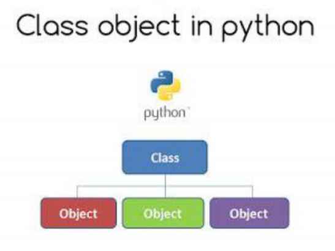
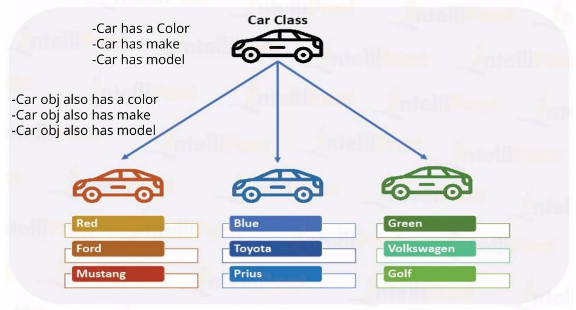

# Classes

Python is an "object-oriented programming language". This means that almost all the code is implemented using a special construct called classes. Programmers use classes to keep related things together. This is done using the keyword "class", which is a grouping of related thnigs.

- [What is a class?](README.md#what-is-a-class)
- [Object](README.md#object)
- [Writing a Class](README.md#writing-a-class)
- [What actually class Hold?](README.md#what-actually-class-hold)
- [Creating an instance](README.md#creating-an-instance)
- [Coding Examples](014_Classes.ipynb)

### What is a class?

- A class is a model
- A class is a blueprint(map) of anything
- A class is a template
- A class may also be defined as someyhing that can be followed to create objects and instances

### Object




### Writing a Class

Python use the keyword "class" to define a class

```
Class Car():
  # Body of the class Car
```

### What actually class Hold?

- A class may hold attributes (variables)
- A class may hold behavious (functions)
- Example:
  - A car's color, model, and seating capacity are attributes of car.
  - A car can run, stop, speed_up, speed_down are behaviours of car.

### Creating an instance

Almost everything in Python is an object, with its properties and methods. Objects are made following its class means if an objects belong to a class it must have been following the requirements by the class

```
class Car():
  # attributes and behaviours
# Creating objects / instance of Car class
  car1 = Car()
  car2 = Car()
```

[<--- Previous Page](../)
